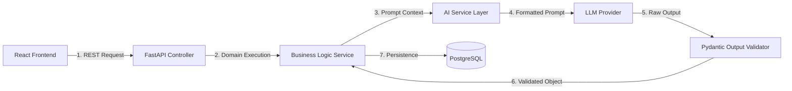
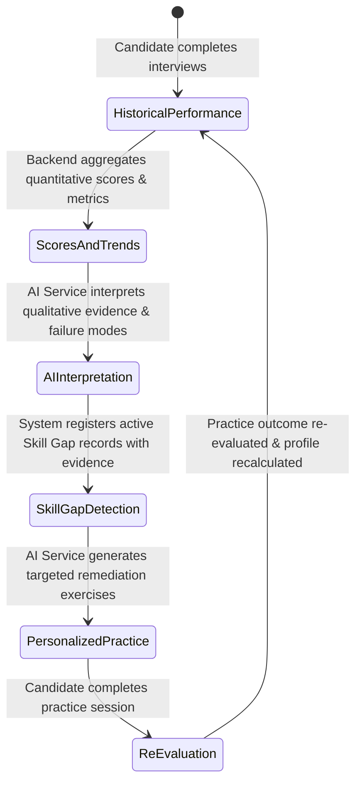
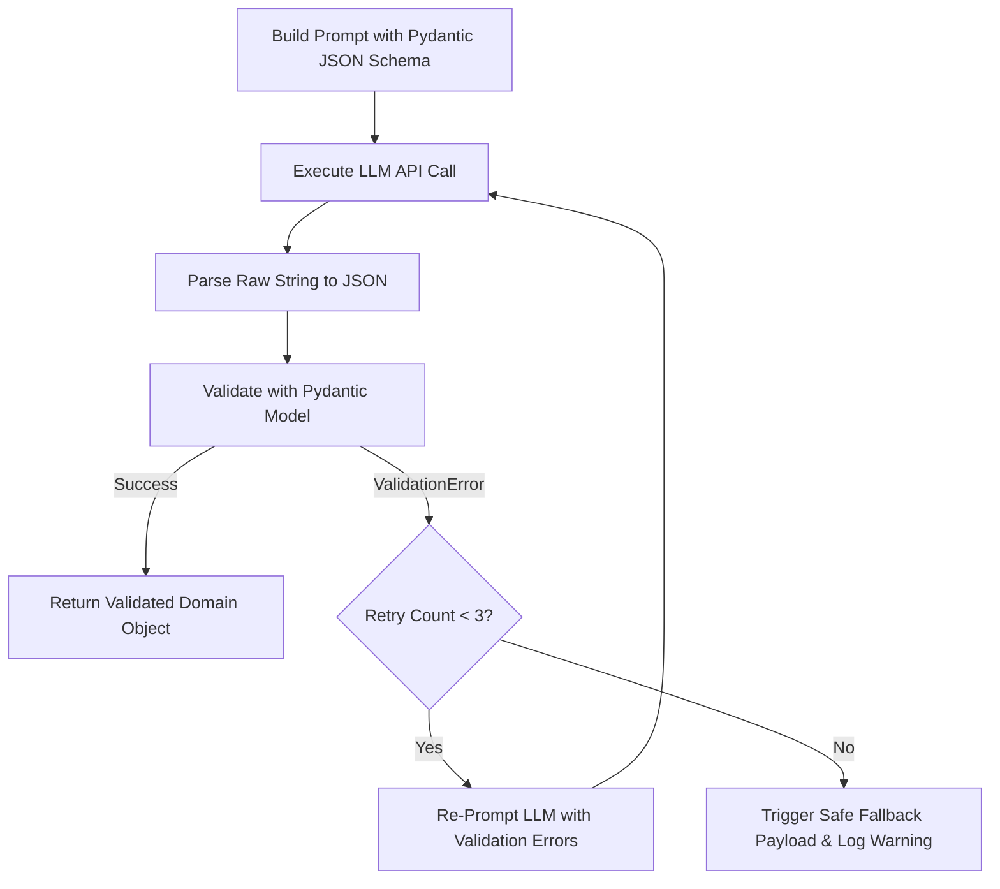

# InterviewIQ — AI Architecture & Readiness Engine Specification

## 1. AI Pipeline Architecture

In InterviewIQ, the LLM is treated as an isolated computational component accessed strictly through a dedicated backend service layer. Direct LLM calls from client applications are prohibited.



---

## 2. Core AI Responsibilities

| Functionality | Input Context | Output Payload | Purpose |
| :--- | :--- | :--- | :--- |
| **Resume Analysis** | Extracted plain text resume | Extracted skills list, competency matrix, domain experience summary. | Establishes candidate baseline & tailors interview questions. |
| **Adaptive Question Generation** | Resume skills, target role, previous Q&A evaluations, difficulty level | Question text, target skill, question category, difficulty grade. | Generates dynamic, context-aware interview questions. |
| **Answer Evaluation** | Question text, target rubric, user's submitted answer text | Overall score (0-100), clarity score, technical accuracy, feedback, strengths, weak points. | Provides multi-dimensional quantitative and qualitative feedback per answer. |
| **Readiness Analysis** | Historical scores, evaluation logs, time trends | Readiness score (0-100), trend status (`improving`/`declining`/`stable`), category scores. | Synthesizes historical performance into high-level readiness metrics. |
| **Weakness Detection** | Aggregated evaluation weak points across multiple interviews | Skill gap name, category, severity rating (`low`/`medium`/`high`/`critical`), historical evidence references. | Automatically pinpoints recurring skill gaps across sessions. |
| **Personalized Practice Generation** | Identified active skill gaps, candidate target role | Targeted practice scenarios, prompts, key learning focus areas. | Delivers custom remediation exercises to resolve specific weaknesses. |

---

## 3. Signature Feature: InterviewIQ Readiness Engine

The **InterviewIQ Readiness Engine** is the core intelligence system of InterviewIQ. It operates as a dynamic, closed-loop feedback mechanism combining **deterministic backend statistics** with **AI qualitative reasoning**.

### 3.1 The Readiness Cycle



### 3.2 Hybrid Processing Strategy

The Readiness Engine avoids relying purely on LLM guesswork by enforcing a 2-tier hybrid calculation model:

1. **Deterministic Tier (FastAPI / SQL)**:
   - Aggregates mathematical averages of `overall_score`, `clarity_score`, and `technical_accuracy_score` across recent sessions.
   - Computes weighted historical decay (recent interviews weighted higher than old interviews).
   - Flags candidate skills with repeated low evaluation scores (<70.0) as potential weak points.

2. **AI Reasoning Tier (Backend AI Service)**:
   - Analyzes qualitative `weak_points` text across multiple evaluation records.
   - Groups related mistakes into high-level conceptual skill gaps (e.g., merging "failed to handle NULLs in SQL query" and "forgot database index on foreign key" into a unified skill gap: `Database Optimization & Integrity`).
   - Assigns severity ratings based on target role expectations.
   - Synthesizes narrative readiness insights for candidate feedback.

---

## 4. Structured Output & Validation Layer

LLM responses are unpredictable by default. InterviewIQ enforces deterministic response structure through **Pydantic Schema Validation** and strict JSON output mode.

### 4.1 Validation & Retry Workflow



### 4.2 Representative Pydantic Schema Specifications

```python
# Conceptual Pydantic Schema for Answer Evaluation
from pydantic import BaseModel, Field
from typing import List

class AnswerEvaluationSchema(BaseModel):
    overall_score: float = Field(..., ge=0.0, le=100.0, description="Weighted overall score out of 100")
    clarity_score: float = Field(..., ge=0.0, le=100.0, description="Clarity and articulation score out of 100")
    technical_accuracy_score: float = Field(..., ge=0.0, le=100.0, description="Technical correctness score out of 100")
    feedback_summary: str = Field(..., min_length=20, description="Constructive narrative summary of the answer")
    strengths: List[str] = Field(..., description="List of specific positive elements in the answer")
    weak_points: List[str] = Field(..., description="List of specific conceptual or technical errors")

class QuestionGenerationSchema(BaseModel):
    question_text: str = Field(..., min_length=15, description="The interview question prompt")
    question_type: str = Field(..., description="Category: technical, behavioral, or system_design")
    target_skill: str = Field(..., description="Specific skill being assessed")
    difficulty: str = Field(..., description="Difficulty rating: easy, medium, or hard")
```

---

## 5. AI Security & Isolation Principles

1. **Backend Isolation**: The LLM API key (`LLM_API_KEY`) is accessible exclusively inside `apps/backend/app/ai/`. Client requests cannot trigger direct LLM invocations without passing through FastAPI authentication and permission middleware.
2. **Prompt Injection Guardrails**: User-supplied input (resume text, interview answers) is sanitized and enclosed in strict XML structural demarcators (e.g. `<user_answer>...</user_answer>`) within system prompts to prevent instruction override attacks.
3. **No Direct Code Execution**: LLM responses are parsed as structured data objects. Under no circumstances will raw LLM text be executed via `eval()` or unsanitized shell calls.
