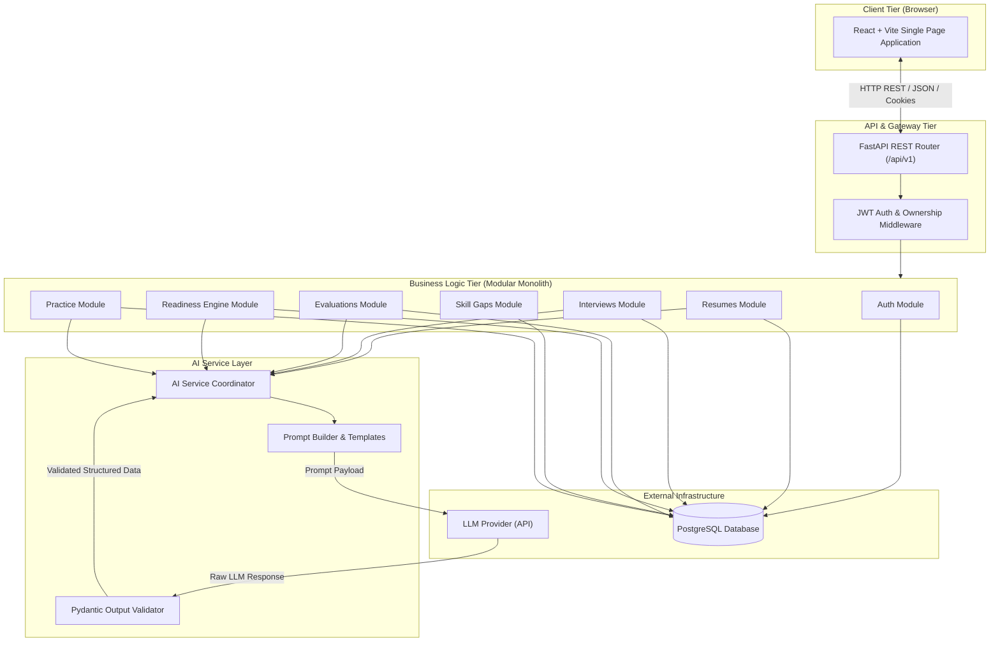
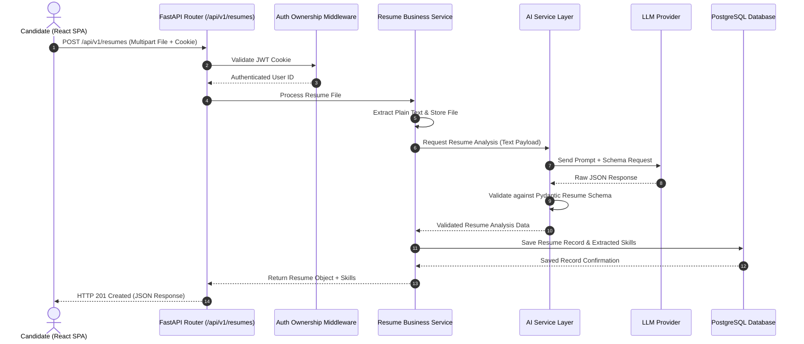
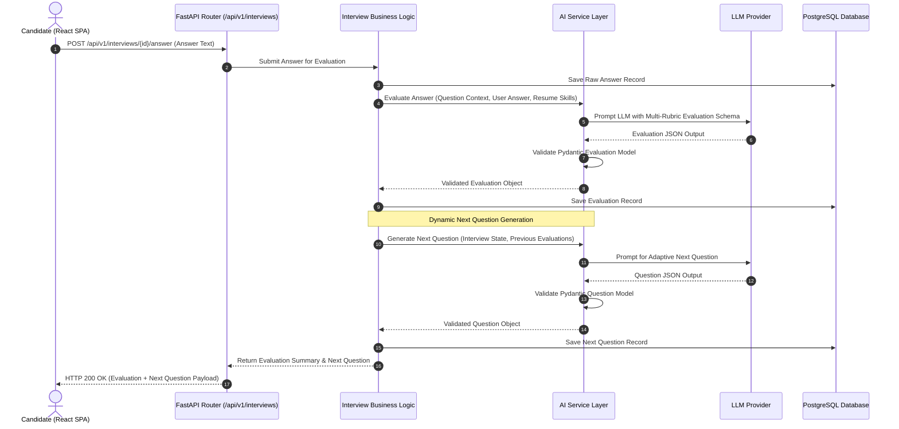

# InterviewIQ — System Architecture Document

## 1. Architectural Overview

InterviewIQ is architected as a **Modular Monolith** contained within a single **Monorepo**. This approach combines operational simplicity, low latency, and single-deployment ease with clear internal domain separation, enabling straightforward future decomposition into microservices if scaling requirements demand it.

### Core Architectural Principles
1. **Modular Monolith**: Code is partitioned into distinct functional modules (`auth`, `resumes`, `interviews`, `evaluations`, `readiness`, `skill-gaps`, `practice`). Each module encapsulates its data access logic, domain models, and API routers.
2. **Backend-Only AI Access**: The LLM is **never** accessed directly from the client. All AI interactions pass through the FastAPI backend's business logic layer, AI service layer, output validation, and database persistence layers.
3. **Stateless API & Secure Session Handling**: Backend APIs operate statelessly, authenticating clients via HTTP-only, secure, SameSite JWT cookies.
4. **Deterministic + AI Hybrid Processing**: The system combines deterministic score calculations and historical metrics in PostgreSQL with qualitative AI evaluation and reasoning.

---

## 2. High-Level Architecture Diagram



---

## 3. Monorepo Folder Structure

```
interview-iq/
├── apps/
│   ├── frontend/               # React + Vite Application
│   │   ├── src/
│   │   │   ├── components/     # UI Components
│   │   │   ├── pages/          # View Pages (Auth, Resume, Interview, Report, Readiness)
│   │   │   ├── services/       # API Client & Fetchers
│   │   │   ├── hooks/          # Custom React Hooks
│   │   │   └── context/        # Auth & State Contexts
│   │   └── package.json
│   │
│   └── backend/                # FastAPI Application (Modular Monolith)
│       ├── app/
│       │   ├── main.py         # Application Entrypoint & Middleware Setup
│       │   ├── config.py       # Pydantic Settings & Env Variable Loader
│       │   ├── core/           # Core Utilities (Database, Security, Logging)
│       │   │   ├── database.py
│       │   │   ├── security.py # Argon2id & JWT Handlers
│       │   │   └── deps.py     # FastAPI Dependencies (Current User, Ownership Check)
│       │   │
│       │   ├── modules/        # Modular Monolith Boundaries
│       │   │   ├── auth/       # Routers, Schemas, Services, Models
│       │   │   ├── resumes/
│       │   │   ├── interviews/
│       │   │   ├── evaluations/
│       │   │   ├── readiness/
│       │   │   ├── skill_gaps/
│       │   │   └── practice/
│       │   │
│       │   └── ai/             # Centralized AI Service Layer
│       │       ├── client.py   # Provider API Client Isolation
│       │       ├── prompts/    # Versioned Prompt Templates
│       │       ├── validators.py # Pydantic LLM Output Schemas
│       │       └── engine.py   # AI Service Coordinator
│       │
│       └── requirements.txt
├── docs/
│   ├── architecture.md
│   ├── database.md
│   ├── api.md
│   └── ai-design.md
├── README.md
└── .gitignore
```

---

## 4. Core Modules & Boundaries

| Module Name | Responsibilities | Dependencies |
| :--- | :--- | :--- |
| `auth` | User registration, login, logout, password hashing, JWT creation/verification, session validation. | `core/security`, Database |
| `resumes` | Resume file ingestion, text extraction, skill extraction via AI, resume version persistence. | `ai/engine`, Database |
| `interviews` | Session initialization, dynamic state tracking, next-question orchestration, type management (technical/behavioral/mixed). | `resumes`, `ai/engine`, Database |
| `evaluations` | Answer submission ingestion, multi-metric scoring via AI, performance feedback formatting. | `interviews`, `ai/engine`, Database |
| `readiness` | InterviewIQ Readiness Engine: historical score aggregation, trend computation, AI interpretation, profile snapshot updates. | `evaluations`, `skill_gaps`, `ai/engine`, Database |
| `skill_gaps` | Identified weakness tracking, gap severity grading, historical evidence aggregation, gap resolution state. | `readiness`, Database |
| `practice` | Targeted practice exercise generation based on active skill gaps, submission handling, re-evaluation triggers. | `skill_gaps`, `ai/engine`, Database |

---

## 5. Security Architecture & Authentication

The planned authentication architecture uses secure password hashing and HTTP-only cookie-based authentication for protected routes.

### 5.1 Password Hashing
Password credentials are hashed using **Argon2id** (`argon2-cffi`), the winner of the Password Hashing Competition. Argon2id provides memory-hard protection against GPU and ASIC cracking attempts.

### 5.2 JWT Session Management
- **Token Format**: Standard JSON Web Token (JWT) signed with a strong secret (`SECRET_KEY`) using `HS256`.
- **Storage Strategy**: Tokens are delivered exclusively via `HTTP-only`, `Secure` (in HTTPS/production), `SameSite=Lax` cookies named `access_token`. This eliminates client-side XSS access to tokens.
- **Expiration & Revocation**: Short-lived access tokens with explicit logout handling that clears the client cookie.

### 5.3 Authorization & User-Resource Ownership
Protected API routes use custom FastAPI dependency injection (`get_current_user`, `verify_resource_owner`). Access control rules strictly enforce that users can only view, edit, or delete entities belonging to their own `user_id`.

```python
# Conceptual Authorization Dependency Pattern
async def verify_interview_ownership(interview_id: UUID, current_user: User = Depends(get_current_user), db: Session = Depends(get_db)):
    interview = db.query(Interview).filter(Interview.id == interview_id).first()
    if not interview or interview.user_id != current_user.id:
        raise HTTPException(status_code=404, detail="Interview session not found")
    return interview
```

### 5.4 Secret Management
All sensitive runtime configurations (database URIs, JWT signing keys, LLM API keys) are loaded strictly via Pydantic `BaseSettings` reading environment variables (`.env`). Secrets are never committed to source control.

---

## 6. End-to-End Execution Data Flows

### 6.1 Resume Upload & Analysis Flow



### 6.2 Interview Question Generation & Answer Evaluation Flow



---

## 7. Operational & Technical Constraints

1. **REST API Versioning**: All public and client-facing endpoints must begin with `/api/v1`.
2. **LLM Isolation**: Application components outside `app/ai/` must never construct raw prompts or communicate directly with external LLM APIs.
3. **Database Transactions**: All database updates crossing module boundaries (e.g., Evaluation creation + Readiness recalculation) must be executed inside explicit atomic database transactions.
